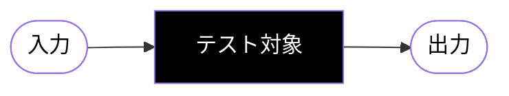

# todoapp-tdd

このリポジトリは、TDDワークショップのための演習教材である。
題材として、Spring Boot + DynamoDB を使った簡単な TODO アプリを作成する。

このワークショップの目的は2つある:

- システムの機能を外側からテストする方法 (blackbox test) を習得してもらう。
- TDDによってリファクタリングが安心してできることを体験してもらう。

## ファイル

- `README.md`: このファイル。
- `docker-compose.yml`: LocalStackを動かすためのファイル。
- `backend/`: 実際のbackendコードが入っているフォルダ。(Spring Initializrで作成)
- `localstack/`: LocalStack初期化用スクリプト。

## 使い方

1. `git clone https://github.com/yusukeshinyama/todoapp-tdd` する。
2. トップレベルのフォルダで `$ docker compose up` を実行。
3. `backend`フォルダで `$ make test` を実行し、エラーが出ないことを確認。
4. `backend/src/test/.../TodoApplicationTests.kt` を開き、
   コメントアウトされているテストを埋めていく。
   この段階では Controllerクラスのみですべての機能を実装する。
5. リファクタリングして Service層、Repository層を分離する。

## 最終的に作りたいもの

TODOアプリのバックエンド。
なお、キーの形式は一意な文字列であればなんでもよい。

```shell
# 2つの項目を新規に作成する。
$ curl -d '{"text":"foo"}' http://localhost:8080/api/todo
$ curl -d '{"text":"bar"}' http://localhost:8080/api/todo

# 作成した項目の一覧がJSONで取得できる。
$ curl http://localhost:8080/api/todo
[{"id":"1", "text":"foo"}, {"id":"2", "text":"bar"}]

# IDを指定してひとつの項目を個別に取得できる。
$ curl http://localhost:8080/api/todo/1
{"id":"1", text:"foo"}

# IDを指定して項目を削除できる。
$ curl -X DELETE http://localhost:8080/api/todo/1
# 削除されていることを確認。
$ curl http://localhost:8080/api/todo
[{"id":"2", "text":"bar"}]
```

### ブラックボックステストの考え方

テストするときは、基本的にテスト対象は「ブラックボックス」であると考える。
つまり、テスト対象の内部は未知であり、ふるまいを外からテストする唯一の手段は
その入力を変化させ、その出力を観察することしかできない。
したがって、テストする場合には
「どういう入力→出力の変化を確認すれば、期待通りのふるまいであると確信できるのか?」
を考えることになる。



## 複数ユーザへの拡張

バックエンドを拡張して、複数のユーザに対応できるようにする。
(ここではデータベースは新たに作り直すものとし、既存データのマイグレーションは考えなくてよい)

```shell
# ユーザjohnに対して、項目を新規に作成する。
$ curl -d '{"text":"foo"}' http://localhost:8080/api/todo/john
# ユーザmaryに対して、項目を新規に作成する。
$ curl -d '{"text":"bar"}' http://localhost:8080/api/todo/mary

# ユーザjohnに対して、作成した項目の一覧がJSONで取得できる。
$ curl http://localhost:8080/api/todo/john
[{"id":"1", "text":"foo"}]
# ユーザmaryに対して、作成した項目の一覧がJSONで取得できる。
$ curl http://localhost:8080/api/todo/mary
[{"id":"2", "text":"foo"}]
```
